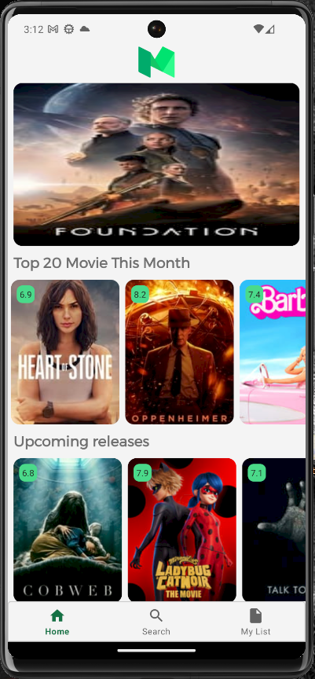
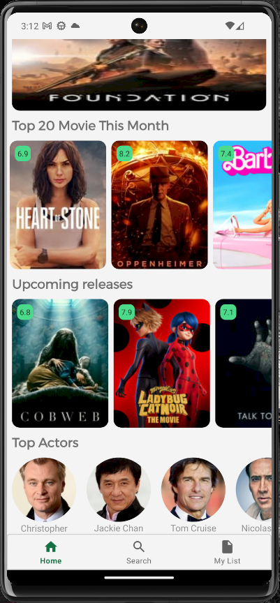

# Movie App
A simple and interactive movie app that allows users to explore trending movies, TV shows, and more.

# Technologies Used:

- Kotlin
- Clean Architecture
- MVVM
- kotlin Cououtines
- Retrofit
- Dagger Hilt
- Glide
- Flows

# Used Api: 
- [https://api.openai.com/](https://api.themoviedb.org/3/)

# Screenshots: 

# Getting Started:

- Clone the repository to your local machine.
- Obtain an API key from TMDB and add it to the project's configuration.
- Build and run the application on an Android emulator or a physical device.
- Feel free to explore the code. Happy coding!

